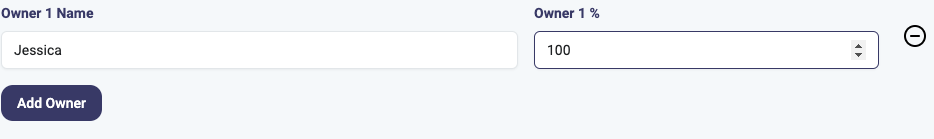
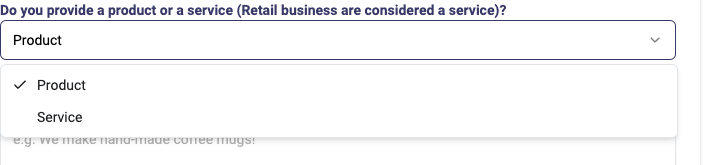

# Fixes for dashboard

- [x] Move heading from business page to dashboard but remove the business profile button.
- [x] Make articles row that mimics featured articles on articles page third card should be see all card.
- [x] Move Lendica widget to where learning widget is on sidebar.
- [x] Move Ocrolus widget to work directly on dashboard page.
- [x] Add redeem card to benefits row and remove learning card.
- [ ] Add breadcrumbs to top when not on user dashboard.
- [x] Remove points and change to business Useful insight slider.
- [ ] Fix the back button on questions to go back to where the user was.

---

- [x] Move contact us to user menu.
- [x] Add 7a Teaser where contact us card was.

- Content:

  - Heading: SBA 7A Help
  - Text: Click here for a free SBA 7A consultation to help you figure out your eligibility and craft the perfect application.
  - Icon: [https://lucide.dev/icons/pen-tool](pen)

- [x] Remove banner placeholder on transaction page for ocrolus

---

- [x] Add future plans to model for SBA Business Plan Generator
- [x] Add legalStructure field to the SBA Business Plan Questions

---

- [x] Need to pull logo from s3 for partner and add a field for url
[x] Push to prod
- [x] Finish new signup flow
- [x] 444240 - Nursery, Garden Center, and Farm Supply Retaile- rs

```log
    2023-09-20 08:37:49.297 [hansa_app] [INFO] iad b04c 5683d3d1fd1538 hansa-app   issues: [
    2023-09-20 08:37:49.297 [hansa_app] [INFO] iad b04c 5683d3d1fd1538 hansa-app     {
    2023-09-20 08:37:49.297 [hansa_app] [INFO] iad b04c 5683d3d1fd1538 hansa-app       received: 'Invalid ID - No NAICS exists for the given id',
    2023-09-20 08:37:49.297 [hansa_app] [INFO] iad b04c 5683d3d1fd1538 hansa-app       code: 'invalid_enum_value',
    2023-09-20 08:37:49.297 [hansa_app] [INFO] iad b04c 5683d3d1fd1538 hansa-app       options: [Array],
    2023-09-20 08:37:49.297 [hansa_app] [INFO] iad b04c 5683d3d1fd1538 hansa-app       path: [],
    2023-09-20 08:37:49.297 [hansa_app] [INFO] iad b04c 5683d3d1fd1538 hansa-app       message: "Invalid enum value. Expected 'true' | 'false', received 'Invalid ID - No NAICS exists for the given id'
    2023-09-20 08:37:49.297 [hansa_app] [INFO] iad b04c 5683d3d1fd1538 hansa-app     }
    2023-09-20 08:37:49.297 [hansa_app] [INFO] iad b04c 5683d3d1fd1538 hansa-app   ],
    2023-09-20 08:37:49.297 [hansa_app] [INFO] iad b04c 5683d3d1fd1538 hansa-app   addIssue: [Function (anonymous)],
    2023-09-20 08:37:49.297 [hansa_app] [INFO] iad b04c 5683d3d1fd1538 hansa-app   addIssues: [Function (anonymous)],
    2023-09-20 08:37:49.297 [hansa_app] [INFO] iad b04c 5683d3d1fd1538 hansa-app   errors: [
    2023-09-20 08:37:49.297 [hansa_app] [INFO] iad b04c 5683d3d1fd1538 hansa-app     {
    2023-09-20 08:37:49.297 [hansa_app] [INFO] iad b04c 5683d3d1fd1538 hansa-app       received: 'Invalid ID - No NAICS exists for the given id',
    2023-09-20 08:37:49.297 [hansa_app] [INFO] iad b04c 5683d3d1fd1538 hansa-app       code: 'invalid_enum_value',
    2023-09-20 08:37:49.297 [hansa_app] [INFO] iad b04c 5683d3d1fd1538 hansa-app       options: [Array],
    2023-09-20 08:37:49.297 [hansa_app] [INFO] iad b04c 5683d3d1fd1538 hansa-app       path: [],
    2023-09-20 08:37:49.297 [hansa_app] [INFO] iad b04c 5683d3d1fd1538 hansa-app       message: "Invalid enum value. Expected 'true' | 'false', received 'Invalid ID - No NAICS exists for the given id'
    2023-09-20 08:37:49.297 [hansa_app] [INFO] iad b04c 5683d3d1fd1538 hansa-app     }
    2023-09-20 08:37:49.297 [hansa_app] [INFO] iad b04c 5683d3d1fd1538 hansa-app   ]
    2023-09-20 08:37:49.297 [hansa_app] [INFO] iad b04c 5683d3d1fd1538 hansa-app }
```

---

- [x] Update functions during to add enigma data location data
- [x] Update get Enigma data to check if its in our db (sort by created at to make sure its the freshest even though we haven't built that yet)
- [ ] 2 concepts
- [ ] enriching/correcting data which we will continue to use a generation service
- [ ] hey we didn't find any data related to this very important data point what is it and here's ways to fix it


- [x] No green alert for NAICS check
- [x] NAICS not prefilled in NAICS check
- [x] change revenue to number in NAICS check
- [x] Save and exit change to next step on loan calc
- [x] Ownership change alert to just "Success!"
- [x] Employees in Business not pre-filled
- [x] Where you business is located Business Plan
- [x] borrow amount should be prefilled Business Plan
- [x] Loading indicator in business plan
- [x] Full plan z-index in business plan
- [x] Business name needs to wrap on dashboard
- [ ] Need to encrypt the pins in the db
- [ ] Bug where user with active pin in partner page can navigate back
- [ ] Need to make admin pages for the partner stuff
- [ ] Updating phone numbers in phone numbers question doesn't update the TLD record
- [ ] Need to test fail path for email verifier doesn't seem to give the user feedback
- [x] J. Galt Emails and Threshold
- [x] Remove phone number
  - [x] Look into making a way for the user to add and verify phone number in a widget
- [x] Update business plan to have establish date
- [ ] When user has finished claim and verify it needs to be removed/swapped out in the slider
- [ ] Need to fix all image imports to be src based and not import based.
- [ ] Veriff component needs to be server only code
- [ ] Need to get rid of all the extranaeous import index's
- [ ] Use all lucide icons instead of svg based ones
- [ ] Need to make a resources folder of the app for things like healthcheck
- [ ] Get rid of all `*.d.ts` files
- [ ] ⬣ ESLint: app/routes/$businessId+/dashboard+/components/onboarding-modal.tsx#L30 All imports in the declaration are only used as types. Use `import type`
- [ ] Only run playwright on PR
- [ ] Add db creds to our 1password
- [ ] Remove `console.log(pattern)` from the `sba\small-business\index.tsx` route
- [ ] Look into adding this <https://github.com/Code-Forge-Net/Remix-Dev-Tools#how-it-looks>
- [x] SiteMap <https://github.com/fedeya/remix-sitemap>
- [x] Remove martin+test1@withhansa.com from prod
- [ ] Fix Ownership structure 
- [ ] Dropdown formatting is not correct 
- [ ] Add this for our Emails [https://react.email/docs/introduction](https://react.email/docs/introduction)
- [ ] Configure helmet correctly [https://github.com/helmetjs/helmet](https://github.com/helmetjs/helmet)
- [ ] Make sure sentry is setup correct [https://docs.sentry.io/platforms/javascript/guides/remix/manual-setup/?original_referrer=https%3A%2F%2Fwww.google.com%2F](https://docs.sentry.io/platforms/javascript/guides/remix/manual-setup/?original_referrer=https%3A%2F%2Fwww.google.com%2F)
- [ ] Add winston [https://github.com/winstonjs/winston](https://github.com/winstonjs/winston)
- [ ] Upgrade postgres images [https://fly.io/docs/postgres/managing/upgrades/](how to upgrade postgres)
- [ ] Remove VERIFF_FEATURE_FLAG from the app